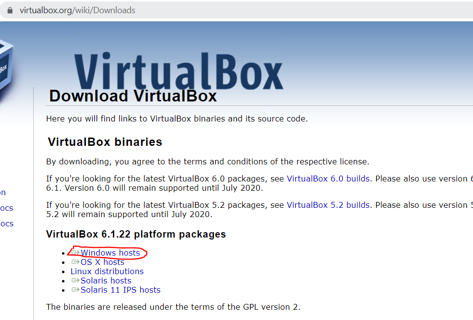
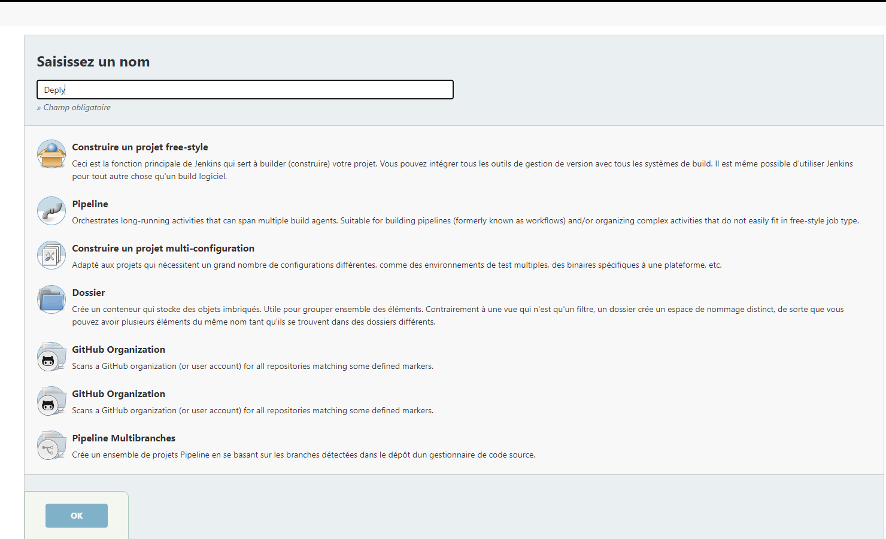
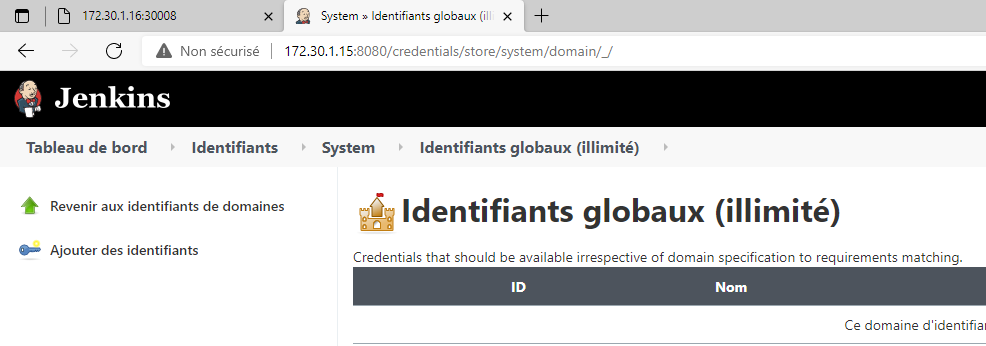

# Sujet TP – CI/CD

**Ce document a pour but de guider et d'aider l'utilisateur à installer les différents environnements, exécuter les différents scripts.**

## Organisation du projet

Pour pouvoir mener à bien ce projet, le premier jour nous avons recueilli les besoins du client que nous avons transformé en story. 
Toutes ces stories, nous les avons mises sur notre taskworld.
Chaque story a été découpée en petite tâche par la suite. Dans la continuité, une fois toutes les tâches recensées, nous avons commencé à mettre en place les différents environnement.

Le document va se présenter en 3 parties:

0. Pré-requis
1. Installation de l'environnement CI/CD
2. Installation de notre serveur jenkins sur l'interface web
3. Fonctionnement du CI/CD

## Information sur notre environnement CI/CD
|Serveurs  | Noms Serveurs Vagrant |     @IP    | Port |
| ------------- |:-------------:|:-------------|-----------------------|
| Master     | envjenkins    |   172.30.1.15            | |
| target      | envdeply     |   172.30.1.16            |  |

## Comment fonctionne notre chaine d'intégration

### Architecture Applicative


## 0. Pré-requis

L'essentiel des installations nécessaires pour lancer et faire fonctionner ce projet sont automatisées et réalisées à l'intérieur des machines virtuelles (vm) générées sur la base du fichier "Vagrantfile" qu'il est possible de retrouver dans le dossier source du projet.
Les seules installations à réaliser par l'utilisateur pour être en mesure de lancer le projet sont celles permettant de le récupérer depuis le dépot Github sur lequel il est stocké (ie Git) et celles permettant de lancer et faire tourner les vm (ie Vagrant et Virtualbox).

Il est considéré comme déjà établi que l'utilisateur possède une machine sur laquelle une version récente de Windows est disponible, et qu'un navigateur internet est déjà installé.

Pour réaliser les installations de Vagrant et de Git nous passerons pas l'intermédiaire de Chocolatey, qui est donc à installer en sus.

### Installation de Chocolatey

Veuillez suivre les étapes décrites dans la partie 2 de la page "Installating Chocolatey" que l'on retrouve en suivant l'url "chocolatey.org/install".


### Installation de VirtualBox

Rendez-vous à l'url virtualbox.org/wiki/Downloads. Puis cliquez sur le lien "Windows hosts" dans la section "VirtualBox 6.1.22 platform packages".



Le téléchargement de l'installer de VirtualBox se lance.
Aller dans le dossier téléchargement, double cliquer sur l'exécutable qui a été télécharger et suivre les étapes de l'installation de Virtualbox.

### Installation de Vagrant et Git

Pour installer vagrant ouvrir en tant qu'administrateur un invite de commande Windows (taper commande dans la barre de recherche de Windows).
Puis taper la commande "choco install vagrant". Attendre la fin de l'installation.


Ensuite pour installer Git taper la commande "choco install git.install". Attendre la fin de l'installation.


### Récupération du projet depuis Github

Créer un dossier dans lequel sera stocké le contenu du projet.
Entrer dans ce dossier et faire un clic droit. Sélectionner "Git Bash Here" et cliquer dessus.


Un invite de commande Git Bash doit s'ouvrir.


Dans cet invite de commande taper la commande suivante : "git clone https://github.com/KevinGit31/repos_tp_ci_cd.git "
A la fin du clone un dossier "repos_tp_ci_cd" doit maintenant être présent. Entrer dedans avec la commande "cd repos_tp_ci_cd".

Vous êtes maintenant prêt(e) à réaliser les étapes suivantes et installer la chaîne CICD mise en place au cours de ce projet.

## 1. Installation de l'environnement CI/CD

Notre environnement est composé de deux serveurs: 
- un serveur "jenkins" sur lequel jenkins est installé et à partir duquel nous accèderons à l'interface web de jenkins. Ansible y est également installé et il nous servira donc également de master pour le playbook ansible.
- un serveur "deploy" qui sera le target du playbook ansible. Sur celui-ci nous installons l'environnement kubernetes et c'est à partir de lui que nous lancerons le cluster kubernetes qui déploiera les trois environnements.

Pour installer ces deux serveurs il suffit de jouer la commande "vagrant up", dans un terminal (Git bash par exemple) ouvert dans le dossier source du projet, qui lancera l'installation des deux serveurs de manière automatique.

Le nom du serveur jenkins est "envjenkins" et celui du serveur de déploiement est "envdeploy".

Il est nécessaire de d'abord créer la vm du serveur de déploiement puis celle du serveur jenkins. En effet l'installation du serveur jenkins contient des étapes consistant à préparer la connexion ssh du serveur jenkins vers le serveur de déploiement, entre autre par partage de clefs. Cette action ne peut être réalisée que dans le cas où le serveur de déploiement est déjà opérationnel.

En temps normal il suffit de jouer la commande "vagrant up" dans le dossier source du projet pour lancer la création de la vm de déploiement puis de la vm jenkins. Si jamais besoin était de créer chaque vm séparément les commandes sont les suivantes:
- "vagrant up envdeploy" pour créer la vm du serveur de déploiement.
- "vagrant up envjenkins" pour créer la vm du serveur jenkins.
La création de la vm du serveur jenkins ne doit pas être lancée tant que le serveur de déploiement n'est pas opérationnel. Pour vérifier l'état de la vm de déploiement il suffit de taper la commande "vagrant status" dans un terminal ouvert dans le dossier source du projet. Si le "state" de envdeploy est différent de "running" il faut alors jouer d'abird la commande "vagrant destroy -f envdeploy" puis la commande "vagrant up envdeploy", avant de joeur la commande "vagrant up envjenkins".


Si la vm du serveur de déploiement est lancée seule via la commande "vagrant up envdeploy" dans un terminal ouvert dans le dossier source du projet alors il est nécessaire de détruire la vm jenkins puis de la recréer pour s'assurer de la bonne connexion entre les deux machines. Ceci à l'aide des commandes "vagrant destroy -f envjenkins" puis "vagrant up envjenkins" toutes deux tapées dans un terminal ouvert dans le dossier source du projet.

Une fois l'installation faite, vous devez avoir ce message dans l'invite de commande:
- le mot de passe initial de l'admin jenkins /!\ penser à le noter quelque part
- l'ip du serveur jenkins pour pouvoir se connecter ici c'est 172.30.1.15:8080
- Et si tout c'est bien passé, on affiche alors "Success" et "A reboot is required"


### Serveur de deploiement
#### Installation de l'environnement Kubernetes

Nous avons fait le choix d'utiliser Minikube (serveur mono node kubernetes).
Les installations liées à Kubernetes vont donc se regrouper en deux parties: l'installation de kubernetes lui-même et celle de Minikube.
##### Installation de Kubernetes

Tout d'abord une première phase avec quelques installations d'utilitaires qui vont permettre de simplifier les installations suivantes.
Puis récupération de la clef gpg de kubernetes, et l'installation du package de Kubectl.

##### Installation et lancement de Minikube

Par défaut Minikube se lance en utilisant VirtualBox comme driver, mais d'autres sont utilisables. Sur notre VM Linux VirtualBox n'est pas une option.
Deux drivers nous intéressent : docker et none. Le driver "none" est celui recommandé pour lancer Minikube dans une VM.
L'utilisation de ce driver nécessite tout de même l'installation de docker. Elle demande aussi que conntrack soit installé et que l'utilisateur soit root.
On commence par installer conntrack et docker.
Puis on récupère le package de Minikube et on l'installe.
Enfin on lance Minikube, qui va donc tourner dès la création de la VM, sur le compte root, avec la commande minikube start --driver=none.


#### Création du user jenkins

Nous allons également créer un user "jenkins" qui sera utilisé par Jenkins lorsque le serveur jenkins se connectera au serveur de déploiement via le playbook Ansible.
Première étape, créer le user : s'il existe déjà on le supprime et on le recrée, sinon on le crée.
Deuxième étape, gérer ses droits : le user jenkins a besoin de droits d'admin pour pouvoir déployer le cluster Kubernetes à travers des commandes du playbook Ansible.
Enfin on permet l'authentification par password pour permettre les étapes de configuration de la connexion ssh par le serveur jenkins dans la suite du déroulement.

### Serveur Jenkins

Après l'installation terminé, nous allons redemarrer notre serveur jenkins. Pour cela nous taper la commande:
​
```
vagrant halt envjenkins
```
​
Puis, une fois le prompt nous ait remit, on tape la commande suivante:
​
```
vagrant up envjenkins
```
​
Voilà notre machine jenkins est up. Nous allons pouvoir passer à l'installation de notre jenkins côté web
​
### Serveur Jenkins partie web
​
Après avoir fait un up sur notre serveur jenkins, nous pouvons désormais le configurer sur la partie web.
​
Pour cela, nous allons ouvrir un navigateur (chrome, firefox...) et nous allons taper l'url suivant
​
```
http://172.30.1.15:8080/
```
​
Une fois l'url validé nous allons attérir sur une première fenêtre
​

​
Il faudra saisir le mot de passe administrateur jenkins pour pouvoir de déploquer, une fois le mot de passe saisie,
on va cliquer sur  "continuer" pour l'installation des plugins.
​

​
Nous allons cliquer sur l'option "Installer les plugins suggérés" et laisser jenkins installer tous les plugins qu'il lui faut pour bien fonctionner.
Une fois terminer allons devoir créer le premier utilisateur administrateur de jenkins.
​

​

​
Pour la création du premier utilisateur, nous vous recommandons, des identiants que vous puissez garder quelques part sans les oublier,
ils vous seront utils. Une fois créé, nous allons passer à la configuration de l'instance.
​

​
Pour la configuration de l'instance jenkins, laisser les valeurs par défaut, puis cliquer sur "sauver et continuer".
Voilà, jenkins est prêt. :)
​

​
Cliquer sur "commencer à utiliser jenkins".
​
Nous voilà sur l'interface de jenkins.
​

​
Nous allons créer notre premier pipeline qui va nous permettre de faire du CI/CD. Cliquer sur le bouton "créer un job".
Une nouvelle fenêtre va s'afficher:
​

​
Nous allons saisir un nom et quel type de job que nous voulons créer. Dans la rubrique "saisissez un nom" on va le nommer "Deploy",
puis nous aller cliquer sur l'option "pipeline" pour avoir un job jenkins de type "pipeline". Et enfin pour valider nous allons cliquer sur "OK" pour valider notre choix.
​
Une fois validée, nous allons configurer notre pipeline:
​

​
Nous allons cliquer sur la rubrique "pipeline", puis dans la partie "definition" on va sélectionner
"pipeline script from SCM" puis dans la partie "SCM", nous allons sélectionner "Git", "Repository URL" nous
allons mettre l'url de notre dépot git qui est le suivant:  "https://github.com/KevinGit31/repos_tp_ci_cd".
​


​
Ensuite dans la partie "branches to build" "branch specifier" on va mettre "\*/main\" et par defaut, la partie "script path" sera "jenkinsfile"
Une fois tous ces élément saisie, nous allons cliquer sur "sauver".
​
Voilà, notre job pipeline a été créé.
​

​
Nous allons passer à la partie administration, nous allons cliquer sur "administrer jenkins" qui se trouve sur le menu de gauche.
​

​
Une fois arriver sur la page d'administration de jenkins, nous allons cliquer sur la rubrique "gestion des plugins" c'est le petit logo vert :)
​

​
Une fois arrivé sur la page de gestion des plugins, on va cliquer sur l'onglet "Disponibles" et dans la barre de recherche nous allons taper le mot clé
"docker" puis sélectionner le plugin "docker pipeline", nous allons cocher la petite case et ensuite cliquer sur "download now and install after restart"
​

​

​
Une fois après avoir cliquer sur "download now and install after restart", une nouvelle fenêtre va s'afficher, on va laisser jenkins
installer le plugin puis une fois le plugin installer, nous allons cocher la case "Redémarrer jenkins quand l'installation est terminée et qu'aucun job n'est en cours"
​

​
Faite un petit f5 pour rafraichir la page, quand jenkins aura redémarré, il vous demandera vos identiants saisis lors de la création du utilisateur administrateur.
​
Une fois sur l'interface de jenkins, nous allons cliquer sur administrer jenkins sur le menu de gauche.
​

​
Puis nous allons cliquer sur le menu "Manage credentials" nous allons renseigner nos credentials pour pouvoir,
push notre image docker sur le dockerhub.
​

​
Une fois arriver sur la page manage credentials, nous allons cliquer sur "Jenkins" dans la rubrique "Stores scoped to jenkins"
​

​
Une fois arriver sur la nouvelle page, on va cliquer sur "Identifiants globaux" qui se trouve dans la rubrique "System"
​

​
Nous allons arriver sur une nouvelle page, nous allons cliquer sur le menu "Ajouter des identiants" qui se trouve sur le menu de gauche.
​

​
Une fois après avoir cliqué sur "Ajouter des identiants", nous allons arriver sur une page pour pouvoir ajouter notre nouveau credentials.
Pour info les informations présentes sur la capture d'écran doivent être recopié telles qu'elles le sont.

​
Type: Nom d'utilisateur et mot de passe
Portée: global(Jenkins, agents, items, etc...)
Nom d'utilisateur: kevin31300
Mot de passe: 19051905?Ke
La case "Treat username as secret" doit être cochée
ID: kevin_docker_hub_token
Description: credentials to login to docker (il y a une petite faute)
​
Une fois les informations notés on peut cliquer sur "OK" pour valider la création de notre credentials, qui servir à notre pipeline précédement créé
pour pouvoir pousser des images docker dans le hub docker.
​

​
Une fois terminé, nous allons cliquer sur l'onglet "tableau de bord" puis cliquer sur notre job pipeline "Deploy"
​

​

​
Une fois ces deux étapes faites, nous pouvons lancer notre pipeline qui va récupérer notre code source puis en faire une
image docker puis la tester si tout se passe bien alors nous allons pousser notre image sur le docker hub et enfin notre processus
de "deploy" qui va lancer un playbook ansible pour mettre à jour l'application sur les différents environnement (test, dev, prod).
​
### Serveur de déploiement installation final admin
​
Une fois l'installation de notre solution CI/CD terminé, nous allons répéter les étapes qui vont suivre.
​
nous allons nous mettre sur le répertoire "repos_tp_ci_cd".
​

​
Puis faire un clic droit dans le répertoire et ensuite cliquer sur l'option "git bash here"
​

​
Une fois après avoir cliqué sur l'option "git bash here" une invite de commande va s'affichier.
​

​
Une fois l'invite de commande s'affiche, nous allons taper la commande suivante:
​
```
vagrant ssh envdeploy
```
Cette commande va nous permettre de nous connecter en ssh sur le serveur de deploiement.
​

​
​
Puis, une fois le prompt nous ait remit, on tape la commande suivante:
​
```
sudo su
```
​
Elle va nous permettre de nous connecter en tant que admin sur notre serveur de deploiement, une fois connecté,
on va taper la commande suivante:
​
```
systemctl enable kubelet.service
```
Cette commande va activer kubelet sur notre serveur de deploiement. Une fois activé nous allons supprimer minikube
avec la commande suivante:
​
```
sudo minikube delete
```
​
Une fois le prompt nous ait remis, nous allons réinstaller minikube, avec la commande suivante
​
```
sudo minikube start --driver=none
```
​
Et enfin une fois l'installation fini, nous pouvons vérifier que minikube est bien "running" avec la commande:
​
```
minikube status
```
​

​


## 3. Fonctionnement du CICD

Notre chaîne CICD s'articule de la manière suivante.
Le code de l'application (en python 3) est stocké sur un dépot GitHub. Jenkins, à travers les étapes décrite dans le Jenkinsfile du projet, va récupérer ce code, le tester, puis build une image Docker qui contenerise un environnement permettant le lancement d'une application en Flask/Python et lance notre application. Cette aplication ets mise en ligne sur DockerHub. Des tests fonctionnels sont ensuite réalisés en déployant une première fois cette image Docker. Une fois ces tests fonctionnels valides, un playbook Ansible se charge d'effectuer le déploiement de cette image docker sur un cluster Kubernetes, fonctionnant sur la machine virtuelle envdeploy.

Les différentes étapes de la chaîne sont décrites ci-après.

### Cluster Kubernetes

Nous avons choisi de déployer notre cluster Kubernetes à partir d'un fichier yaml de déploiement, comprenant l'aspect "pod" et "service" du déploiement.
L'image utilisée est celle corespondant à la dernière version de l'application poussée sur DockerHub. Ainsi la version de l'application est remplacée dans le fichier par un mot clef qui servira à insérer la dernière version en date au moment de l'exécution de la commande de déploiement.
La clef "imagePullPolicy" est passée à "Always" afin de s'assurer que même en présence d'une image docker du projet sur le serveur de déploiement, un pull de la dernière version disponible sur DockerHub serait réalisée. Ainsi nous somme sûr que chaque déploiement se réalise avec la version demandée.
Dans la description des 3 services (test, dev et prod) nous redirigeons le port 5000 (correspondant au port utilisé par une application en Python/Flask) vers les ports 30007,30008 et 30009, dans l'intervalle des ports admis de base par Kubernetes, et choisis de manière complètement arbitraire.


